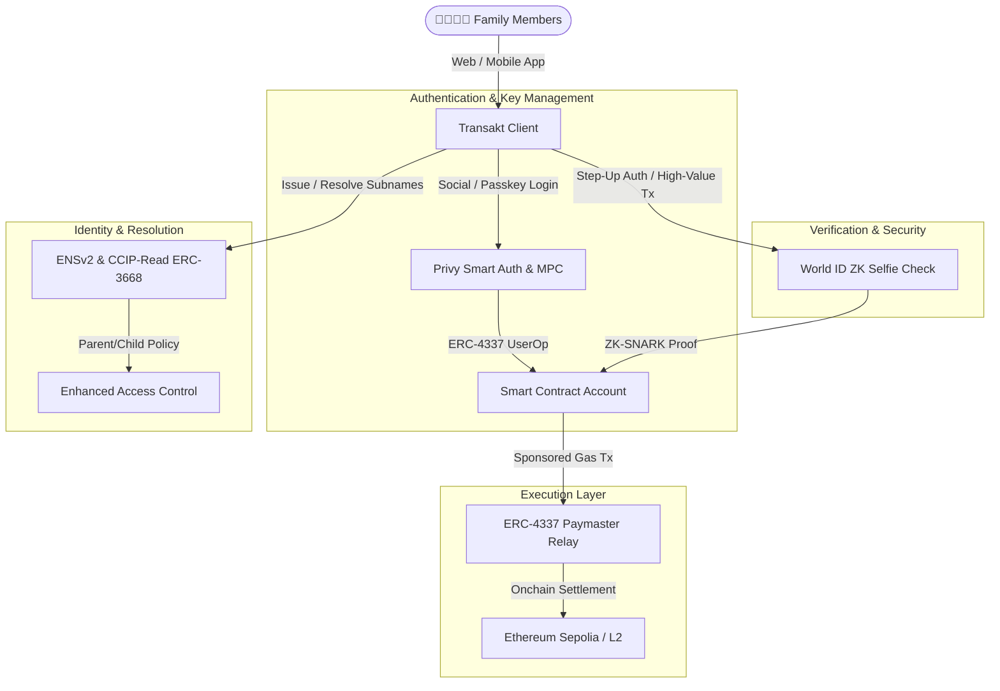

# 🛡️ Transakt — Crypto for the Whole Family. Made Simple.

  

  <strong>Non-custodial family treasury, ENSv2 subname issuance, automated allowances, and World ID verification.</strong>

  
  
  
  
  

---

## 📖 Overview

**Transakt** is a non-custodial family treasury and crypto management platform designed to make onchain finance accessible, secure, and intuitive for every generation. 

Traditional crypto wallets require dealing with 42-character hexadecimal addresses, complex seed phrases, gas management, and zero safety nets for family members. **Transakt solves this** by combining **ENSv2 sub-identities**, **Privy account abstraction**, and **World ID zero-knowledge biometric verification** into a single, cohesive experience.

Parents can create a family namespace (e.g. `smithfam.eth`), distribute custom gasless subnames to their children (e.g. `alex.smithfam.eth`), automate weekly pocket money allowances with strict spending limits, and enforce biometric step-up authentication for sensitive actions.

---

## ✨ Key Features

### 👤 1. Frictionless Onboarding (Powered by Privy)
- **One-Tap Sign-In:** Onboard family members via email, SMS, socials, or passkeys without requiring seed phrases.
- **Embedded MPC Wallets:** Non-custodial multi-party computation ensures keys are sharded securely across devices with zero single point of failure.
- **ERC-4337 Account Abstraction:** Smart accounts with gas sponsorship via paymasters—users never worry about holding raw ETH for gas.

### 🏷️ 2. ENSv2 Family Subname Issuance
- **Human-Readable Identities:** Replace confusing hex addresses with readable handles (`alex.smithfam.eth`, `mom.smithfam.eth`, `vault.smithfam.eth`).
- **Parent-Enforced Policies:** Parent nodes retain lifecycle rules and permission management over child subnames.
- **Gasless Offchain & L2 Resolution:** Fast, low-cost subname minting and resolution via ERC-3668 (CCIP-Read).

### ⏳ 3. Automated Allowances & Guardrails
- **Automated Drops:** Schedule weekly or monthly allowance transfers directly to family member sub-accounts.
- **Granular Spending Limits:** Set custom weekly budgets (e.g., $50/week) with automatic spend resets.
- **DeFi & Protocol Locks:** Restrict or grant access to external smart contracts and swaps on a per-member basis.

### 🛡️ 4. World ID Proof-of-Humanity Step-Up Auth
- **Biometric Selfie Check:** Verify unique human identity during high-value transfers or policy modifications.
- **1:1 Zero-Knowledge Proofs (ZK-SNARKs):** No biometric data or selfies are ever stored onchain or transmitted to servers.
- **Anti-Sybil & Guardian Recovery:** Prevent bot takeovers and enable trusted guardian-assisted account recovery.

### 🔄 5. In-App Swaps & Portfolio Management
- **Decentralized Swaps:** Effortlessly trade between ETH, USDC, and other top tokens directly inside the app.
- **Unified Treasury Dashboard:** Track total family net worth, individual sub-account balances, and onchain activity in real time.

---

## 🏛️ Architecture & Tech Stack

### Core Technologies
| Component | Technology | Description |
|---|---|---|
| **Framework** | [Next.js 14](https://nextjs.org/) (App Router) | High-performance React framework with server-side rendering |
| **Styling** | [Tailwind CSS](https://tailwindcss.com/) | Curated modern design system with dynamic light/dark theming |
| **Auth & Wallet** | [Privy](https://www.privy.io/) | Embedded wallets, passkey auth, and MPC key sharding |
| **Naming Service** | [ENSv2](https://ens.domains/) | Offchain and L2 hierarchical subname issuance |
| **Proof of Humanity** | [World ID](https://worldcoin.org/world-id) | Zero-knowledge 1:1 liveness check & Sybil resistance |
| **Network** | Ethereum Sepolia Testnet | Smart contract deployment and gasless paymaster relay |

---
## 📄 License

This project is licensed under the [MIT License](./LICENSE) — feel free to use and adapt it for your own projects.